### Cloud Computing Fundamentals

---
## Cloud Computing Fundamentals: Virtualization & Resource Pooling

*   Introduction to Cloud Computing and its core concepts.
*   Focus on Virtualization as a foundational technology.
*   Hypervisors: The engine of virtualization.
*   Resource Pooling: Optimizing resource utilization in the cloud.

---
## Virtualization: Abstraction of Physical Resources

*   **Definition:** Virtualization is the process of creating a virtual version of something, including hardware platforms, operating systems, storage devices, or network resources.
*   **Key Benefit:** Abstraction of physical hardware, allowing multiple virtual machines (VMs) to run on a single physical server.
*   **Historical Context:** Evolved from mainframe partitioning in the 1960s.
*   **Current Applications:** Foundational for cloud computing, data centers, and software development.

---
## Hypervisors: The Virtualization Engine

*   **Definition:** A hypervisor, also known as a Virtual Machine Monitor (VMM), is software that creates and runs virtual machines.
*   **Types of Hypervisors:**
    *   **Type 1 (Bare-Metal):** Runs directly on the hardware. Examples: VMware ESXi, Microsoft Hyper-V Server, Xen.
    *   **Type 2 (Hosted):** Runs on top of an existing operating system. Examples: VMware Workstation, Oracle VirtualBox.
*   **Key Functions:**
    *   Resource allocation (CPU, memory, storage, network).
    *   VM creation and management.
    *   Isolation and security.

---
## Type 1 vs. Type 2 Hypervisors: A Comparison

| Feature          | Type 1 (Bare-Metal)                               | Type 2 (Hosted)                                  |
|-------------------|----------------------------------------------------|---------------------------------------------------|
| Performance      | Generally higher due to direct hardware access     | Lower due to OS overhead                           |
| Security         | More secure due to smaller attack surface          | Less secure due to reliance on host OS security   |
| Resource Usage   | More efficient resource utilization                | Less efficient due to host OS resource consumption |
| Use Cases        | Production environments, large-scale deployments   | Development, testing, personal use                |

---
## CPU Scheduling in Virtualization

*   **Objective:** Efficiently allocate CPU time to VMs.
*   **Techniques:**
    *   **Round Robin:** Each VM gets a fixed time slice.
    *   **Priority-Based:** VMs are assigned priorities, and higher-priority VMs get more CPU time.
    *   **Fair Scheduling:** Attempts to provide equal CPU time to all VMs.
*   **Considerations:**
    *   Overhead of context switching between VMs.
    *   Impact on VM performance and latency.

---
## Memory Management: Ballooning

*   **Definition:** A technique where the hypervisor reclaims unused memory from VMs.
*   **Mechanism:**
    *   A "balloon driver" inside the VM requests memory from the VM's OS.
    *   The VM's OS then releases the memory to the hypervisor.
*   **Benefits:**
    *   Improved memory utilization.
    *   Reduced risk of memory exhaustion.
*   **Drawbacks:**
    *   Performance overhead due to memory reclamation.

---
## I/O Device Emulation

*   **Definition:** The process of simulating hardware devices for VMs.
*   **Purpose:** Allows VMs to access hardware resources without direct access.
*   **Methods:**
    *   **Full Emulation:** Simulates the entire device.
    *   **Paravirtualization:** Requires modifications to the guest OS to improve performance.
*   **Impact on Performance:** Emulation can introduce significant overhead.

---
## Resource Pooling: Aggregating Resources

*   **Definition:** The practice of combining compute, storage, and network resources into a shared pool.
*   **Benefits:**
    *   Improved resource utilization.
    *   Increased flexibility and scalability.
    *   Reduced costs.
*   **Key Characteristics:**
    *   On-demand allocation.
    *   Elasticity.
    *   Metering and billing.

---
## Elastic Scaling Policies

*   **Definition:** Automated rules that adjust resource allocation based on demand.
*   **Types of Scaling Policies:**
    *   **Target Tracking:** Adjusts resources to maintain a specific target metric (e.g., CPU utilization).
    *   **Step Scaling:** Adds or removes resources based on predefined thresholds.
    *   **Scheduled Scaling:** Adjusts resources based on a predefined schedule.
*   **Metrics for Scaling:**
    *   CPU utilization.
    *   Memory utilization.
    *   Network latency.
    *   Queue depth.

---
## Hypervisor Security Hardening

*   **Micro-segmentation:** Isolating VMs and network segments to limit the impact of security breaches.
*   **Secure Boot Chains:** Ensuring that only trusted software is loaded during the boot process.
*   **Encrypted VM Images:** Protecting sensitive data by encrypting VM images at rest and in transit.
*   **Runtime Integrity Checks:** Monitoring VMs for unauthorized modifications.

---
## Side-Channel Mitigations

*   **Definition:** Techniques to protect against attacks that exploit unintended information leakage from hardware.
*   **Examples:**
    *   Mitigations for speculative execution vulnerabilities (e.g., Spectre, Meltdown).
*   **Impact on Performance:** Mitigations can reduce consolidation ratios and scheduling fairness.

---
## Virtualization Performance Tuning

*   **NUMA-Aware Placement:** Placing VMs on NUMA nodes that are close to the data they access.
*   **Huge Pages:** Using large memory pages to improve TLB efficiency.
*   **SR-IOV (Single Root I/O Virtualization):** Allowing VMs to directly access physical network adapters for near line-rate networking.
*   **Paravirtualized Drivers (VirtIO):** Using drivers that are optimized for virtualized environments to reduce emulation overhead.
*   **CPU Pinning:** Assigning VMs to specific CPU cores to stabilize latency-sensitive workloads.

---
## Network Virtualization

*   **Definition:** The process of abstracting network resources from the underlying physical infrastructure.
*   **Overlay Networks (VXLAN, Geneve):** Creating virtual networks on top of the physical network.
*   **Virtual Switches (OVS):** Software-based switches that provide network connectivity for VMs.
*   **Service Mesh:** An infrastructure layer that manages service-to-service communication.

---
## Overlay Networks: VXLAN and Geneve

*   **VXLAN (Virtual Extensible LAN):** A tunneling protocol that encapsulates Layer 2 Ethernet frames within UDP packets.
*   **Geneve (Generic Network Virtualization Encapsulation):** A more flexible tunneling protocol that supports a wider range of header options.
*   **Benefits:**
    *   Increased scalability.
    *   Multi-tenant isolation.
    *   Improved network mobility.

---
## Virtual Switches (OVS)

*   **Definition:** A software-based switch that runs on a hypervisor.
*   **Key Functions:**
    *   Forwarding traffic between VMs.
    *   Enforcing ACLs (Access Control Lists).
    *   Implementing QoS (Quality of Service).
*   **Benefits:**
    *   Flexibility.
    *   Programmability.
    *   Cost-effectiveness.

---
## Service Mesh: L7 Traffic Management

*   **Definition:** An infrastructure layer that manages service-to-service communication.
*   **Key Features:**
    *   Traffic routing.
    *   Load balancing.
    *   Service discovery.
    *   Security.
    *   Observability.
*   **Examples:** Istio, Linkerd, Consul Connect.

---

---
## Consolidation Ratios

*   **Definition:** The number of virtual machines that can be run on a single physical server.
*   **Factors Affecting Consolidation Ratios:**
    *   Workload characteristics.
    *   Hardware resources.
    *   Hypervisor efficiency.
    *   Security mitigations.
*   **Importance:** Higher consolidation ratios reduce hardware costs and improve resource utilization.

---
## Virtualization: Key Takeaways

*   Virtualization is a foundational technology for cloud computing.
*   Hypervisors are the engines of virtualization.
*   Resource pooling optimizes resource utilization.
*   Security and performance are critical considerations.
*   Network virtualization enables multi-tenant isolation and scalability.

---
## Future Trends in Virtualization

*   **Containerization:** Lightweight virtualization using containers (e.g., Docker, Kubernetes).
*   **Serverless Computing:** Abstracting away the underlying infrastructure.
*   **Edge Computing:** Bringing compute resources closer to the edge of the network.
*   **Confidential Computing:** Protecting data in use by encrypting it within VMs.

---
## References

*   Popek, G. J., & Goldberg, R. P. (1974). Formal requirements for virtualizable third generation architectures. *Communications of the ACM, 17*(7), 412-421.
*   Barham, P., Dragovic, B., Fraser, K., Hand, S., Harris, T., Ho, A., ... & Warfield, A. (2003). Xen and the art of virtualization. *ACM SIGOPS Operating Systems Review, 37*(5), 164-177.
*   Rosenberg, D., Matei, Y., & Foster, I. (2009). Resource pooling for data centers. *IEEE Internet Computing, 13*(4), 62-69.
*   Burns, B., Grant, B., Oppenheimer, D., Brewer, E., & Wilkes, J. (2016). Borg, omega, and kubernetes: Lessons from three container-management systems. *Communications of the ACM, 59*(5), 50-59.
*   National Institute of Standards and Technology (NIST). (2011). *The NIST Definition of Cloud Computing*. (Special Publication 800-145). Gaithersburg, MD.

